# 🔍 Lost & Found - Campus Item Recovery System

A comprehensive web-based Lost & Found application designed to help campus communities recover lost items efficiently. Built with PHP, MySQL, and Bootstrap for a modern, responsive user experience.

## 📋 Table of Contents

- [Features](#features)
- [Screenshots](#screenshots)
- [Installation](#installation)
- [Database Setup](#database-setup)
- [Configuration](#configuration)
- [Usage](#usage)
- [File Structure](#file-structure)
- [Admin Panel](#admin-panel)
- [Security Features](#security-features)
- [Contributing](#contributing)
- [License](#license)

## ✨ Features

### User Features
- **User Registration & Authentication** - Secure login/logout system
- **Post Lost Items** - Report items you've lost with detailed descriptions
- **Post Found Items** - Report items you've found to help others
- **Item Search & Browse** - Search through lost/found items by category, location, or keywords
- **Item Claims** - Claim found items that belong to you
- **User Dashboard** - Manage your posted items and view notifications
- **Profile Management** - Update personal information and profile pictures
- **Photo Uploads** - Attach photos to item listings for better identification
- **Notifications System** - Get notified about item matches and claims

### Admin Features
- **Admin Dashboard** - Overview of system statistics and activities
- **Item Approval System** - Review and approve user-posted items
- **User Management** - Manage user accounts and permissions
- **Claims Management** - Monitor and manage item claims
- **Admin Management** - Add/remove admin users
- **Item Management** - Edit or delete items as needed

### Technical Features
- **Responsive Design** - Works seamlessly on desktop and mobile devices
- **Photo Management** - Automatic photo cleanup and optimization
- **Category System** - Organized item categories for better browsing
- **Security** - Protected against SQL injection and XSS attacks
- **Session Management** - Secure user session handling

## 📸 Screenshots

### Public Pages

#### Homepage
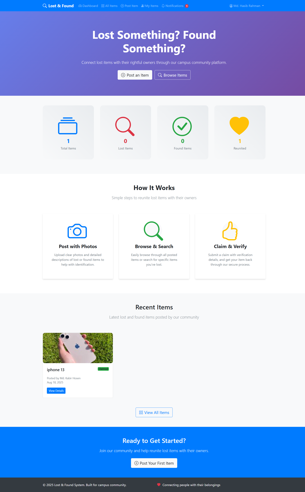
*Clean, modern homepage with statistics and recent items display*

#### Items Browser
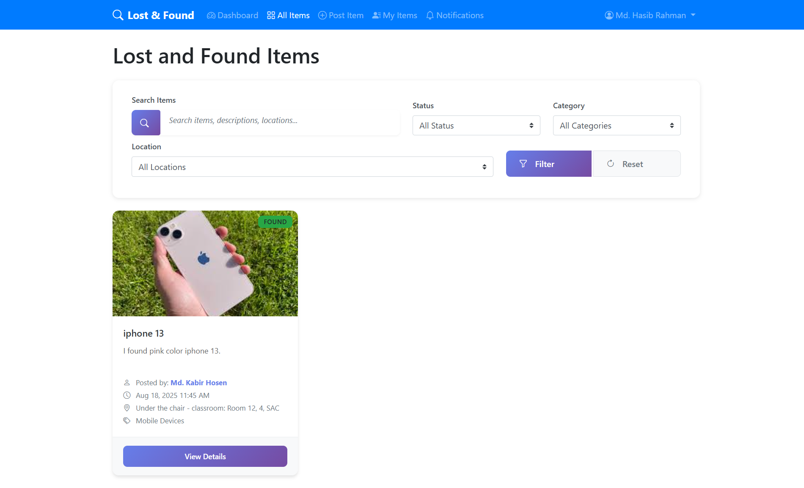
*Browse and search through all lost and found items*

#### Item Details
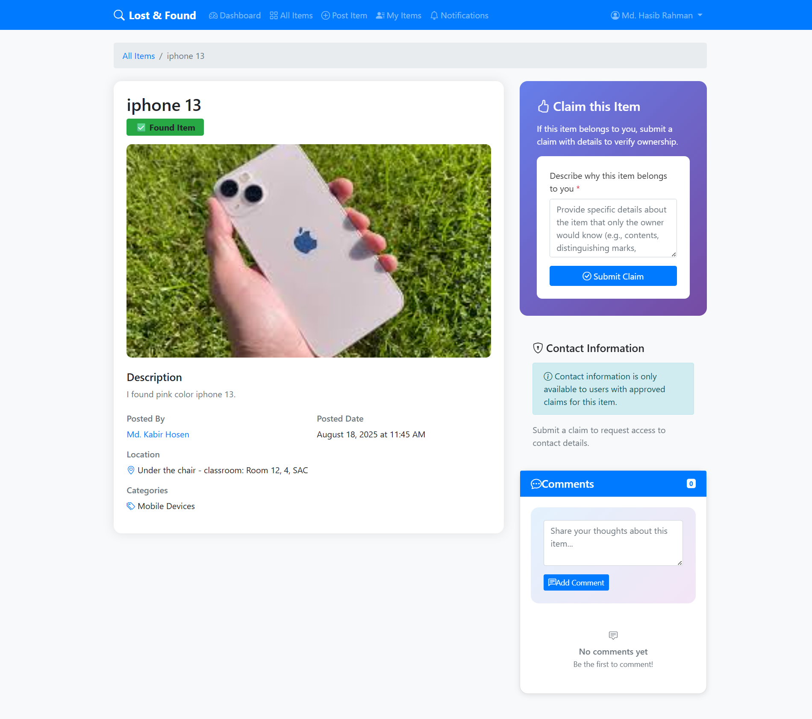
*Detailed item view with photos, description, and contact information*

### Authentication

#### User Registration
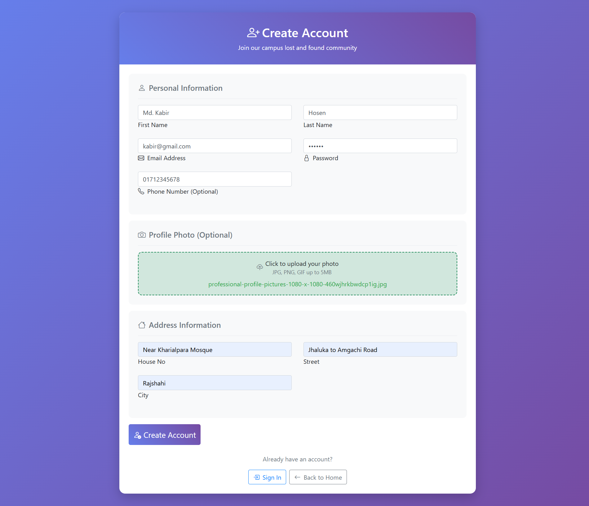
*Simple and secure user registration form*

#### User Login

*Clean login interface with form validation*

### User Dashboard

#### User Dashboard
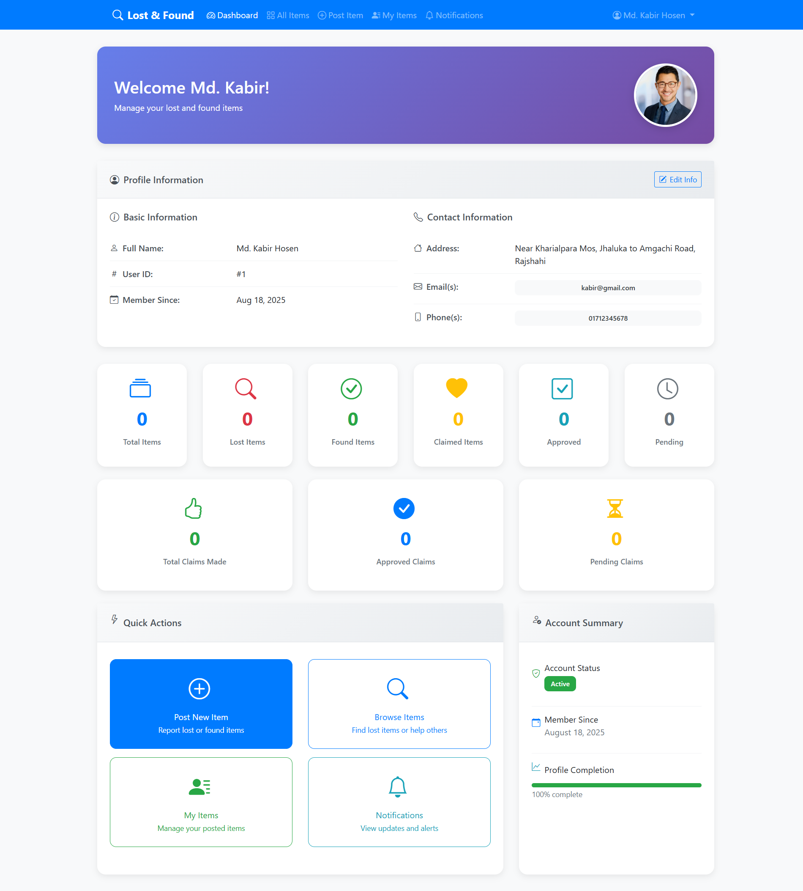
*Personalized dashboard showing user's items and activities*

#### Post Item
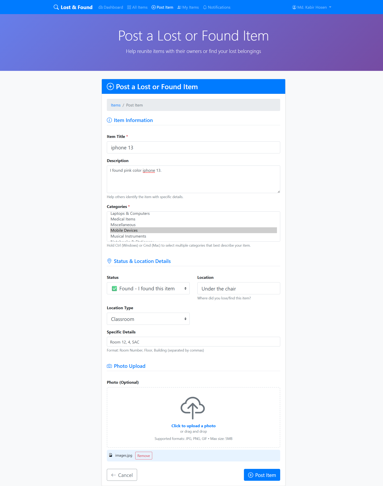
*Easy-to-use form for posting lost or found items*

#### My Items
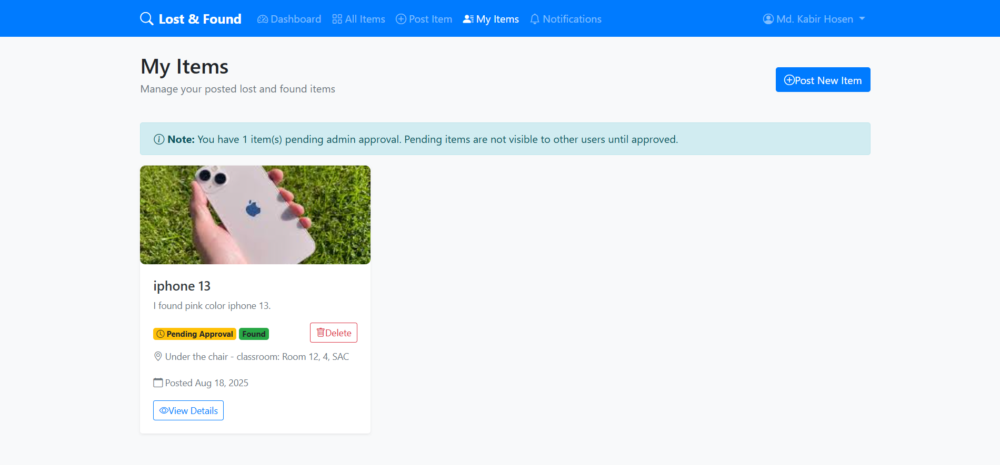
*Manage and view all items posted by the user*

#### Notifications
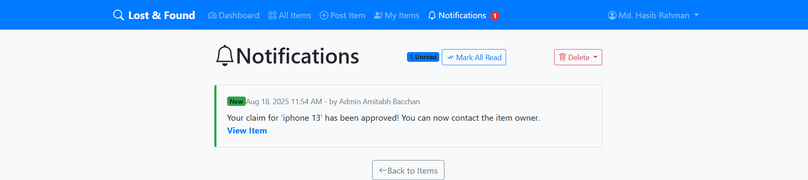
*Stay updated with notifications about item activities*

#### Edit Profile
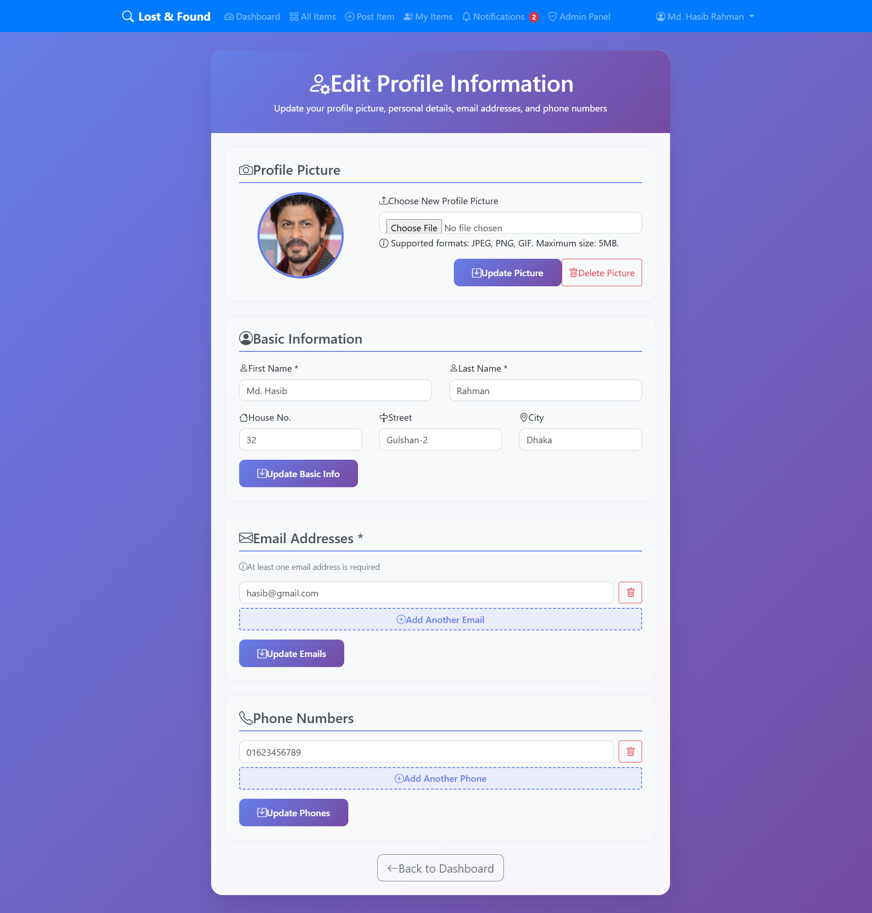
*Update personal information and profile settings*

### Admin Panel

#### Admin Dashboard
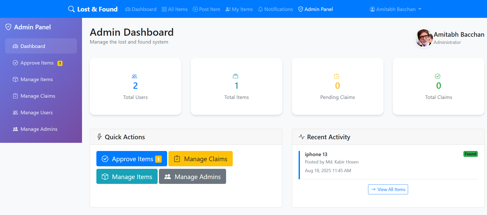
*Comprehensive admin dashboard with system statistics and quick actions*

#### Approve Items
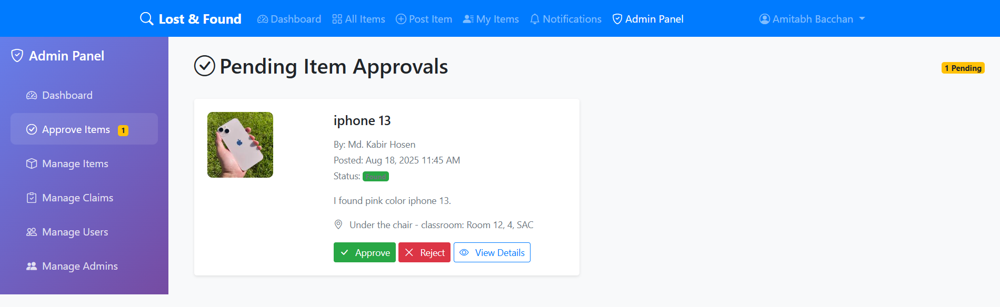
*Review and approve user-submitted items before they go live*

#### Manage Users
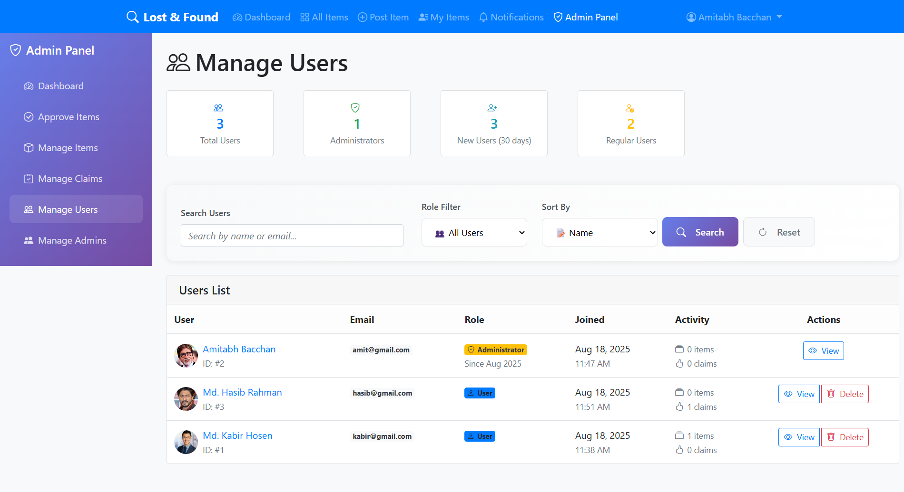
*View and manage all registered users in the system*

#### Manage Items
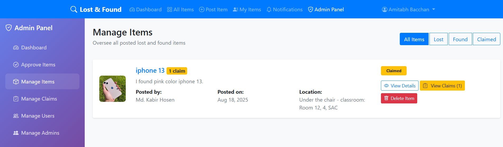
*Comprehensive item management with edit and delete capabilities*

#### Manage Claims
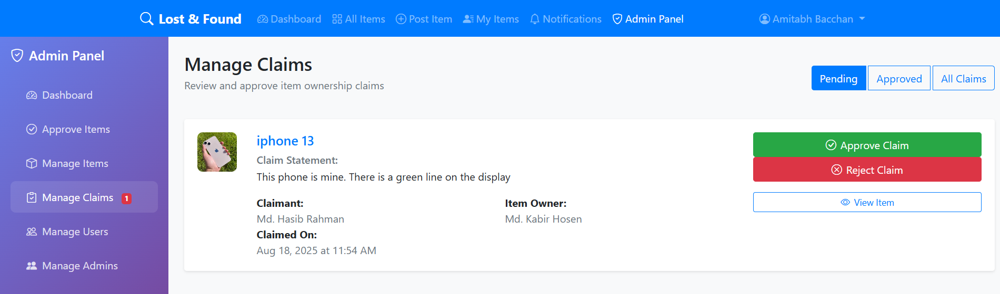
*Handle item claim requests and verify ownership*

#### Manage Admins
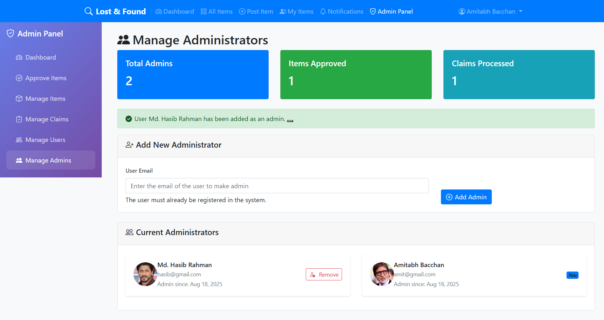
*Add, remove, and manage administrative users*

## 🚀 Installation

### Prerequisites
- **XAMPP** (or any LAMP/WAMP stack)
  - Apache Web Server
  - MySQL Database
  - PHP 7.4 or higher
- Web browser (Chrome, Firefox, Safari, Edge)

### Step 1: Download & Setup
1. Clone or download this repository to your XAMPP htdocs folder:
   ```
   c:\xampp\htdocs\lost-and-found\
   ```

2. Start XAMPP Control Panel and start:
   - Apache
   - MySQL

### Step 2: Database Setup
1. Open phpMyAdmin in your browser: `http://localhost/phpmyadmin`

2. Create the database by running the initialization script:
   - Import `initialize.sql` to create the database structure
   - Optionally run `insert_categories_only.sql` to add default categories

3. Or manually run the SQL commands:
   ```sql
   CREATE DATABASE IF NOT EXISTS lost_and_found;
   USE lost_and_found;
   ```
   Then import the `initialize.sql` file.

### Step 3: Configuration
1. Update database connection settings in `includes/db.php` if needed:
   ```php
   $host = "localhost";
   $user = "root";
   $pass = "";
   $dbname = "lost_and_found";
   ```

2. Ensure the `uploads/` directory has write permissions for photo uploads.

### Step 4: Access the Application
Open your web browser and navigate to:
```
http://localhost/lost-and-found/
```

## 🗄️ Database Setup

The application uses MySQL with the following main tables:

- **users** - User account information
- **items** - Lost and found item listings
- **photos** - Image storage and management
- **categories** - Item categorization
- **claims** - Item claim requests
- **admins** - Administrator accounts
- **notifications** - User notification system

Run these files in order:
1. `initialize.sql` - Creates all tables and structure
2. `insert_categories_only.sql` - Adds default item categories

## ⚙️ Configuration

### Environment Configuration
- **Database**: Configure in `includes/db.php`
- **File Uploads**: Photos are stored in `uploads/` directory
- **Default Images**: Default item image located in `assets/image/default.png`

### Admin Account Setup
1. Register a regular user account
2. Manually update the database to make the user an admin:
   ```sql
   INSERT INTO admins (user_id, created_at) VALUES (1, NOW());
   ```

## 📖 Usage

### For Users
1. **Register/Login**: Create an account or login with existing credentials
2. **Post Items**: Use "Post Item" to report lost or found items
3. **Browse Items**: Search through posted items by category or keywords
4. **Claim Items**: If you find your lost item, submit a claim request
5. **Manage Profile**: Update your information in the user dashboard

### For Admins
1. **Access Admin Panel**: Login and navigate to `/admin/dashboard.php`
2. **Approve Items**: Review and approve user-posted items
3. **Manage Users**: View and manage user accounts
4. **Handle Claims**: Process item claim requests
5. **System Overview**: Monitor application statistics and activities

## 📁 File Structure

```
lost-and-found/
├── index.php                 # Homepage
├── items.php                 # Browse all items
├── item_detail.php          # Individual item details
├── post_item.php            # Post new items
├── my_items.php             # User's posted items
├── notifications.php        # User notifications
├── initialize.sql           # Database schema
├── insert_categories_only.sql # Default categories
├── admin/                   # Admin panel
│   ├── dashboard.php        # Admin dashboard
│   ├── approve_items.php    # Item approval
│   ├── manage_users.php     # User management
│   ├── manage_items.php     # Item management
│   ├── manage_claims.php    # Claims management
│   └── manage_admins.php    # Admin management
├── auth/                    # Authentication
│   ├── login.php           # User login
│   ├── register.php        # User registration
│   └── logout.php          # Logout functionality
├── user/                    # User dashboard
│   ├── dashboard.php       # User dashboard
│   ├── profile.php         # User profile
│   └── edit_info.php       # Edit profile
├── includes/                # Shared components
│   ├── db.php              # Database connection
│   ├── navigation.php      # Main navigation
│   ├── admin_navigation.php # Admin navigation
│   ├── cleanup_photos.php  # Photo cleanup utility
│   └── PhotoCleanupManager.php # Photo management class
├── assets/                  # Static assets
│   ├── css/                # Stylesheets
│   ├── script/             # JavaScript files
│   └── image/              # Images
└── uploads/                 # User uploaded photos
```

## 👨‍💼 Admin Panel

### Dashboard Features
- **Statistics Overview**: Total items, lost/found/claimed counts
- **Recent Activity**: Latest posted items and claims
- **Quick Actions**: Direct access to management functions

### Management Functions
- **Item Approval**: Review items before they go live
- **User Management**: View user details and activity
- **Claims Processing**: Handle item claim requests
- **Admin Management**: Add/remove admin users

### Access Control
- Separate admin authentication system
- Role-based access to admin functions
- Secure admin-only pages

## 🔒 Security Features

- **SQL Injection Protection**: Prepared statements for database queries
- **XSS Prevention**: Input sanitization and output escaping
- **Session Security**: Secure session management
- **File Upload Validation**: Image file type and size validation
- **Access Control**: Protected admin and user areas
- **Password Security**: Hashed password storage

## 🛠️ Technologies Used

- **Backend**: PHP 7.4+
- **Database**: MySQL
- **Frontend**: HTML5, CSS3, JavaScript
- **Framework**: Bootstrap 5
- **Icons**: Bootstrap Icons
- **Server**: Apache (XAMPP)

## 🤝 Contributing

1. Fork the repository
2. Create a feature branch (`git checkout -b feature/AmazingFeature`)
3. Commit your changes (`git commit -m 'Add some AmazingFeature'`)
4. Push to the branch (`git push origin feature/AmazingFeature`)
5. Open a Pull Request

## 🐛 Known Issues

- Photo cleanup runs manually - consider implementing automatic cleanup
- Email notifications not implemented (placeholder for future enhancement)
- Advanced search filters could be expanded

## 🔮 Future Enhancements

- Email notification system
- Mobile app development
- Advanced search and filtering
- Real-time notifications
- Item location mapping
- Multi-language support

## 📞 Support

For support and questions:
1. Check the documentation above
2. Review the code comments in individual files
3. Create an issue in the repository

## 📄 License

This project is open source and available under the [MIT License](LICENSE).

---

**Version**: 1.0  
**Last Updated**: August 2025  
**Developed for**: Campus Lost & Found Management

## 📝 Quick Start Guide

1. **Setup XAMPP** and start Apache + MySQL
2. **Copy files** to `htdocs/lost-and-found/`
3. **Import database** using `initialize.sql`
4. **Access** via `http://localhost/lost-and-found/`
5. **Register** an account and start using!

For admin access, manually add your user ID to the `admins` table in the database.

---

*Happy finding! 🎯*
